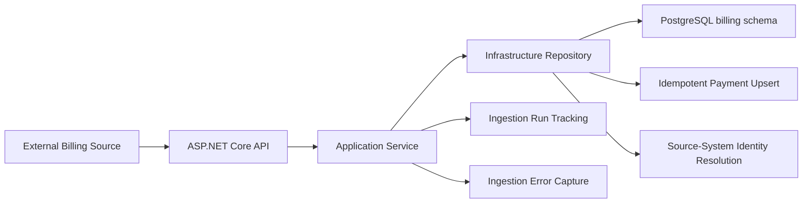

# BillingTracker

BillingTracker is a backend/data-platform sample project for reliable, multi-tenant payment ingestion from external billing systems.

It models the kinds of engineering problems that show up in billing, fintech, healthcare, clinical operations, and other integration-heavy domains: tenant boundaries, source-system identity mapping, idempotent imports, retry-safe updates, relational modeling, ingestion run tracking, error capture, and operational reconciliation.

The primary implementation is a .NET backend with a PostgreSQL data model. A secondary Python/FastAPI implementation exists as an exploratory comparison of API/service/repository structure, but the .NET implementation is the main focus of the project.

## Project Write-Up Series

I am documenting the design and implementation decisions behind BillingTracker in a Hashnode series:

[Building BillingTracker](https://ericdaviddev.hashnode.dev/series/building-billingtracker)

## What This Demonstrates

- Backend API design with ASP.NET Core
- Multi-tenant relational modeling in PostgreSQL
- Canonical internal IDs vs. external source-system IDs
- Idempotent external payment ingestion
- Retry-safe upsert behavior using composite uniqueness
- Source-system and tenant resolution
- Operational ingestion run tracking
- Error capture for failed source records
- Current-state payment records plus lifecycle event history
- Layered architecture across API, application, and infrastructure projects
- Testable service/repository boundaries
- Docker/devcontainer-based local development setup
- Early exploration of parallel service structure in Python/FastAPI

## Architecture Overview



The .NET ingestion flow accepts payment payloads from an external source system, resolves the source system and tenant/client mapping, resolves related business entities, writes an ingestion run, upserts payment records safely, records failed items, and completes the ingestion run with operational counts.

## Current Repository Structure

```text
billingtracker/
├── apis/
│   ├── dotnet/
│   │   ├── src/
│   │   │   ├── BillingTracker.Api/
│   │   │   ├── BillingTracker.Application/
│   │   │   └── BillingTracker.Infrastructure/
│   │   └── tests/
│   │       ├── BillingTracker.Application.Tests/
│   │       └── BillingTracker.Infrastructure.Tests/
│   └── python-fastapi/
│       ├── app/
│       └── tests/
├── samples/
│   └── payment-ingestion-request.json
├── scripts/
│   └── reset-db.sh
├── sql/
│   ├── 00_create_schema.sql
│   ├── billing_create_tables.sql
│   ├── seed_data_inserts.sql
│   ├── simple_queries.sql
│   └── ingestion/
└── .devcontainer/
```

## Primary Implementation: .NET API

The .NET implementation is organized into API, application, and infrastructure layers.

```text
BillingTracker.Api
BillingTracker.Application
BillingTracker.Infrastructure
BillingTracker.Application.Tests
BillingTracker.Infrastructure.Tests
```

### API Layer

The API layer exposes payment ingestion endpoints and handles request/response behavior, logging, and HTTP-level error handling.

Current endpoint:

```http
POST /api/ingestion/payments
```

### Application Layer

The application layer coordinates the payment ingestion workflow. It is responsible for:

- Validating incoming ingestion requests
- Resolving source-system and tenant/client mappings
- Creating ingestion runs
- Processing individual payment records
- Resolving guarantor, dependent, and location identities
- Recording item-level failures
- Returning inserted, updated, failed, and skipped counts

### Infrastructure Layer

The infrastructure layer uses PostgreSQL through Npgsql and implements the repository boundary used by the application service.

It handles:

- Source-system lookup
- Client/source mapping lookup
- Related entity lookup
- Ingestion run creation and completion
- Payment upsert behavior
- Ingestion error inserts

The payment upsert is designed around a composite uniqueness rule:

```sql
unique (client_id, source_system_id, external_payment_id)
```

That allows repeated ingestion attempts to safely update the same canonical payment record instead of creating duplicates.

## Data Model Overview

The schema includes core business tables and operational ingestion tables.

### Business/Core Tables

- `billing.clients`
- `billing.locations`
- `billing.source_systems`
- `billing.client_source_mappings`
- `billing.guarantors`
- `billing.dependents`
- `billing.payments`
- `billing.payment_events`

### Operational/Ingestion Tables

- `billing.ingestion_runs`
- `billing.ingestion_errors`
- `billing.source_sync_state`

## Key Design Concepts

### Multi-Tenant Boundaries

Most business records are associated with a `client_id`, which represents the tenant organization that owns the data.

This makes tenant ownership explicit in the schema and supports future reporting, filtering, ingestion, authorization, and operational boundaries.

### Canonical Identity vs. External Identity

The schema separates internal canonical UUIDs from external source-system identifiers.

For example, a payment has an internal `payment_id`, but also has an `external_payment_id` and a `source_system_id`.

This supports scenarios where:

- Different vendors use overlapping external IDs
- The same tenant integrates with multiple source systems
- Imports need to be retried safely
- External records need to be mapped into canonical internal records
- Operational reconciliation needs to compare internal state against source-system state

### Idempotent Imports

Billing and payment ingestion workflows must tolerate retries. If the same source payload is processed more than once, the system should not create duplicate payment records.

BillingTracker models this with a unique identity boundary across tenant, source system, and external payment ID:

```sql
unique (client_id, source_system_id, external_payment_id)
```

The .NET repository uses PostgreSQL upsert behavior to insert or update payment records while preserving the canonical payment identity.

### Stale Source Updates

External systems may send older records after newer ones have already been processed. The ingestion flow includes `source_updated_at` so stale updates can be skipped rather than overwriting newer source state.

### Current State vs. Event History

The `billing.payments` table represents the current known state of a payment.

The `billing.payment_events` table records lifecycle activity over time, such as creation, posting, reversal, refund, or other payment state changes.

This separation supports operational queries today and future audit/reconciliation workflows.

### Ingestion Run Tracking

The `billing.ingestion_runs` table tracks import and synchronization attempts by client and source system.

It is designed to answer operational questions such as:

- When did a tenant last sync from a source system?
- Did the run complete successfully?
- How many records were received, inserted, updated, or failed?
- What cursor or checkpoint was used?
- Which source system and entity type were involved?

### Ingestion Error Capture

The `billing.ingestion_errors` table captures failed records or operational ingestion issues.

It includes fields such as:

- entity type
- external ID
- error code
- error message
- source payload

The `payload` column is stored as `jsonb` so the original source data can be retained for debugging, replay, or reprocessing scenarios.

### Incremental Sync State

The `billing.source_sync_state` table tracks synchronization checkpoints per tenant, source system, and entity type.

This supports incremental sync strategies such as:

- `updated_since`
- cursor-based pagination
- checkpoint recovery
- entity-specific synchronization progress

## Example Query Areas

The seed data and query scripts are intended to support reporting and reconciliation scenarios such as:

- Payments for managed locations only
- Guarantor payment totals
- Failed or reversed payment analysis
- Latest sync run per tenant/source system
- Ingestion error review
- Source-system synchronization checkpoints
- Duplicate-prevention/idempotency checks

## Local Development

### Database Setup

The SQL scripts can be run directly against PostgreSQL:

```sql
-- 1. Create schema and required extensions
\i sql/00_create_schema.sql

-- 2. Create tables and indexes
\i sql/billing_create_tables.sql

-- 3. Insert seed data
\i sql/seed_data_inserts.sql

-- 4. Run sample queries
\i sql/simple_queries.sql
```

There is also a helper script for resetting the local database:

```bash
./scripts/reset-db.sh
```

### .NET API

From the root folder:

```bash

dotnet restore
dotnet build
dotnet test
```

To run the API:

```bash
cd apis/dotnet/src/BillingTracker.Api

dotnet run
```

A sample ingestion payload is available at:

```text
samples/payment-ingestion-request.json
```

### Python/FastAPI Spike

The Python implementation is currently a secondary exploration of service/repository/API structure. It is intentionally behind the .NET implementation and should not be treated as the primary project implementation.

```bash
cd apis/python-fastapi
python -m venv .venv
source .venv/bin/activate
pip install -r requirements.txt
pytest
```

## Current Status

BillingTracker is an active sample project.

Completed or in progress:

- PostgreSQL billing schema
- Core tenant/source/payment tables
- Composite uniqueness rules for idempotent ingestion
- Operational ingestion tables
- Seed data for query and reporting scenarios
- Sample reporting/reconciliation queries
- .NET API/application/infrastructure project structure
- Initial payment ingestion endpoint
- Source-system and client mapping resolution
- Payment upsert workflow
- Ingestion run tracking
- Ingestion error capture
- Initial application/infrastructure test projects
- Python/FastAPI implementation spike

Planned next areas:

- Broader automated test coverage
- Background ingestion worker
- Queue-based ingestion workflow
- Reconciliation workflows
- Additional payment lifecycle event handling
- Observability/logging improvements
- CI pipeline hardening
- Architecture decision records

## Design Philosophy

This project intentionally starts with the data model because billing and ingestion systems are heavily shaped by identity, ownership, source-system boundaries, retry behavior, and operational visibility.

The goal is not to present a finished commercial billing platform. The goal is to build a realistic backend foundation that supports platform-oriented design discussions and implementation work around ingestion safety, data modeling, idempotency, operational tracking, and maintainable service boundaries.
